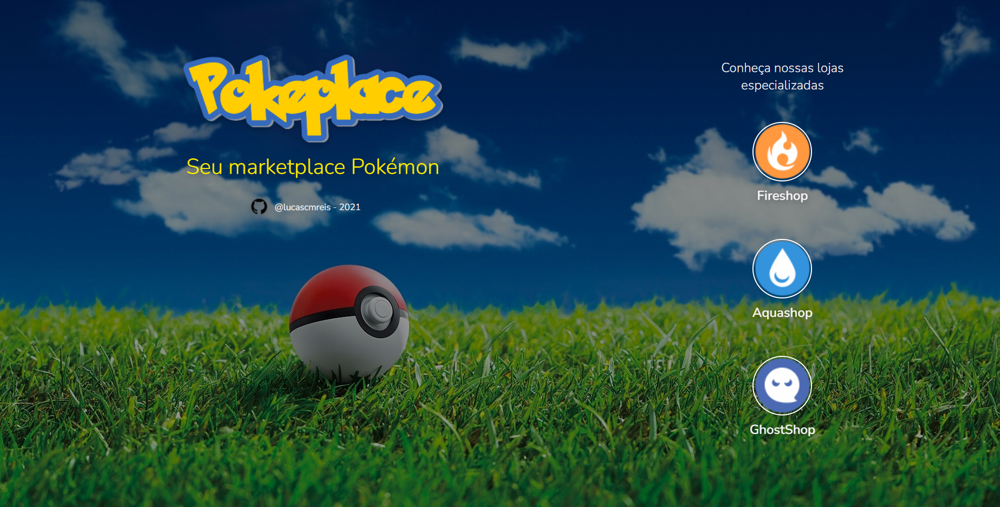

<p align="center">
  
</p>

<p align="center" fontSize="60px">
  Marketplace com Lojas de Pokemon por tipo
</p>

<p align="center">
  
</p>

Link para o projeto [Pokeplace](https://pokeplace.vercel.app/) hospedado na [Vercel](https://vercel.com/)

## 💻 Projeto

Desenvolver 3 lojas virtuais de Pokémon, sendo cada loja de um tipo diferente ( água, fogo, fantasma, etc) .
Todos os dados sobre os pokémons como nome, número, tipo, imagem e entre outras coisas, foram disponilizadas com o uso da API REST [PokéApi](https://pokeapi.co/).

### Funcionalidades

- [x] **Catálogo de produtos**: Listar os pokémon com o uso da API REST, de acordo com o tipo da loja.

- [x] **Carrinho lateral**: Listar os produtos selecionados em um carrinho de compras. O carrinho foi feito na forma de um `SideCart`, que pode ser ocultado. No carrinho é possível atualizar a quantidade, excluir e finalizar a compra

- [x] **Buscar Pokémon**: Método para filtrar os pokémon a partir do seu nome.

- [x] **Resumo do carrinho**: O resumo do carrinho aparece no Header da aplicação, por meio do ícone de cesta. A quantidade resumida é contada para cada pokémon diferente selecionado, independente da quantidade.

- [x] **Botão finalizar compra**: Botão que finaliza a compra no carrinho lateral. Após finalizar a compra, o carrinho da loja é esvaziado e reiniciado o processo de compra.

- [x] **Modal de obrigado**: Ao finalizar a compra é apresentado um modal, com a mensagem de obrigado. Foi adicionado também uma funcionalidade de retorna 15% de Cashback. E uma lista que direciona para outras lojas.

### Funcionalidades Extras

Além das funcionalidades principais foram adicionadas outras ao projeto:

- [x] **Salvar Dados de compra localmente**: Os dados do carrinho de compras são salvos no localStorage. Cada loja armazena seus dados individualmente. Assim, mesmo atualizando a página ou navengando entre as lojas, os dados não se perdem até finalizar a compra.

- [x] **Seção detalhes**: Foi adotado o uso de um modal para apresentar os dados de informações sobre o produto, como tipos, habilidades, altura e peso. Basta clicar no ícone de info, presente em cada card de pokémon.

- [x] **Notificação por toast**: Para interagir e guiar o usuário, foram utilizados Toasts de notificação para apresentar algum aviso( por exemplo, quando tentar finalizar a compra com o carrinho vazio) ou de erro.

- [x] **Gerenciamento de estoque**: Como a API não disponibiliza "estoque de pokémon", foi definido um padrão de no máximo 3 itens de cada no carrinho. A aplicação consegue incrementar e decrementar itens, e retorna um aviso caso a quantidade selecionada seja maior que o estoque definido.

### Conceitos abordados

- Uso de css-in-js e criação de Tema global com o `ThemeProvider` do [styled-components](https://www.styled-components.com/)

- Consumo de api com o uso da lib [axios](https://github.com/axios/axios).

- listagem de pokémon e filtro por nome.

- Configuração de fonte local .

- Criação de um React hook - `useCart`

### Notas

- A estratégia utilizada foi criar um Layout de loja e realizar o consumo da API por "type" e disponibilizar para cada loja. Como se fosse especializada em um tipo de pokemon apenas. Uma vez definido a estrutura da loja, foram criados Temas, com styled-components.

- As 3 lojas estão separadas por rotas `/fireshop` | `/aquashop` | `/ghostshop`. A ideia era deixar as três lojas dentro da mesma aplicação, para facilitar a demostração. Mas cada uma tem seu proprio estado e tema.

- Para criar uma nova loja, basta criar um novo tema e criar uma nova página com o componente Layout, passando o nome do tipo em inglês (e.g.`water` para pokemon de água). Ver nomes disponíveis na documentação da api [PokéApi](https://pokeapi.co/), em caso de dúvidas.

## :rocket: Tecnologias

- [React](https://pt-br.reactjs.org/)
- [React-Icons](https://react-icons.netlify.com/)
- [React Router](https://reactrouter.com/web/guides/quick-start)
- [Styled-components](https://www.styled-components.com/)
- [Axios](https://github.com/axios/axios)
- [React-Modal](github.com/reactjs/react-modal)
- [React-Toastify](https://github.com/fkhadra/react-toastify)
- [Prettier](https://prettier.io/)
- [Eslint](https://eslint.org/)

## 📥 Instalação e execução

Faça um clone desse repositório e acesse o diretório.

```bash
$ git clone https://github.com/lucascmreis/pokeplace.gitt && cd pokeplace
```

```bash
# Instalando as dependências
$ yarn

# Executanto aplicação
$ yarn start

```

## :muscle: Contribuir

Faça o `fork` e clone o projeto a partir do seu usuário.

```bash
# Clonando projeto
$ git clone https://github.com/SEU-NOME-DE-USUARIO/pokedex.git

# Criando um branch
$ git branch minha-alteracao

# Acessando o novo branch
$ git checkout -b minha-alteracao

# Adicionando os arquivos alterados
$ git add .

# Criando commit e a mensagem
$ git commit -m "Corrigindo...."

# Enviando alterações para o brach
$ git push origin minha-alteracao
```

Você deve navegar até o seu repositório onde fez o fork e clicar no botão _New pull request_ no lado esquerdo da página.

## 📝 Licença

Esse projeto está sob a licença MIT. Veja o arquivo [LICENSE](LICENSE.md) para mais detalhes.
